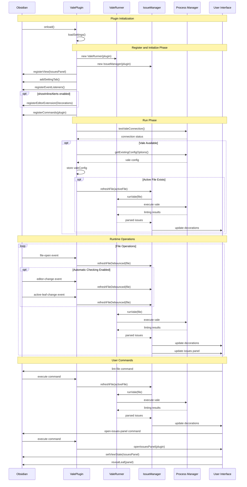

# Obsidian Vale Redux

A plugin that integrates the [Vale](https://vale.sh/) prose linter with Obsidian, providing configurable, offline-first inline style and grammar checking directly in your editor.

## Install

This plugin is in very early development, so expect some weird behaviors and issues. The recommended way to install this plugin is using [BRAT](https://github.com/TfTHacker/obsidian42-brat). You can also download the files from the [latest release](https://github.com/intothebeans/obsidian-vale-redux/releases/latest) and place them in your vault's `.obsidian/plugins/obsidian-vale-redux` folder.

## Architecture

### Plugin Lifecycle

The following sequence diagram illustrates the plugin initialization and operation flow:

## Credits

This plugin was inspired by/forked from [obsidian-vale](https://github.com/ChrisChinchilla/obsidian-vale)
by [Chris Chinchilla](https://github.com/ChrisChinchilla). 
